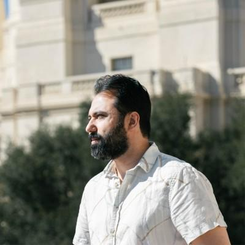

<style>
/* --- Workshop theme (week1-day1 draft; promote to slides/theme.css once locked) --- */
section {
  font-size: 30px;
  line-height: 1.45;
  color: #1c2733;
  justify-content: flex-start;
  padding: 64px 78px 84px;
  font-family: -apple-system, "Segoe UI", "Helvetica Neue", Arial, sans-serif;
}
h2 {
  font-size: 46px;
  color: #15365c;
  margin: 0 0 0.5em;
  padding-bottom: 0.18em;
  border-bottom: 3px solid #e8a04b;
}
h3 { font-size: 32px; color: #15365c; margin: 0.25em 0; }
strong { color: #c2561e; }
ul, ol { margin-top: 0.2em; }
li { margin-bottom: 0.4em; }
li > ul { margin-top: 0.3em; }
em { color: #4a5b6a; }
code {
  background: rgba(21, 54, 92, 0.09);
  padding: 2px 8px;
  border-radius: 6px;
  font-size: 0.86em;
}
pre {
  background: #0f2233;
  border-radius: 12px;
  padding: 20px 26px;
  font-size: 23px;
  line-height: 1.45;
  box-shadow: 0 10px 26px rgba(15, 34, 51, 0.20);
}
pre code { background: transparent; color: #eaf1f8; padding: 0; font-size: 1em; }
/* Syntax colors tuned for the dark code background (overrides the default
   light highlight.js theme, whose dark tokens vanish on dark navy). */
pre code .hljs-comment, pre code .hljs-quote { color: #8b9bb4; font-style: italic; }
pre code .hljs-keyword, pre code .hljs-literal, pre code .hljs-type,
pre code .hljs-selector-tag { color: #c792ea; }
pre code .hljs-string, pre code .hljs-meta .hljs-string,
pre code .hljs-regexp, pre code .hljs-addition { color: #addb67; }
pre code .hljs-title, pre code .hljs-section, pre code .hljs-name { color: #82aaff; }
pre code .hljs-built_in, pre code .hljs-class .hljs-title { color: #ffcb6b; }
pre code .hljs-number, pre code .hljs-symbol, pre code .hljs-bullet { color: #f78c6c; }
pre code .hljs-attr, pre code .hljs-attribute,
pre code .hljs-variable, pre code .hljs-params { color: #eaf1f8; }
pre code .hljs-meta { color: #ffcb6b; }
pre code .hljs-property, pre code .hljs-subst { color: #eaf1f8; }
table { font-size: 27px; }
th { background: rgba(21, 54, 92, 0.10); }
blockquote {
  border-left: 5px solid #e8a04b;
  color: #4a5b6a;
  font-style: italic;
  padding-left: 0.7em;
  margin-left: 0;
}
.flow {
  text-align: center;
  font-size: 34px;
  font-weight: 700;
  color: #15365c;
  background: rgba(255, 255, 255, 0.55);
  border-radius: 14px;
  padding: 14px 10px;
  margin: 6px 0 24px;
}
.flow a { color: #c2561e; text-decoration: none; }
footer { color: #6a7b8a; font-size: 16px; }

/* Title slide over the photo */
section.title {
  justify-content: center;
  color: #fff;
  position: relative;
}
section.title h1 {
  font-size: 58px;
  white-space: nowrap;
  color: #fff;
  margin-bottom: 0.1em;
  text-shadow: 0 2px 10px rgba(0, 0, 0, 0.45);
}
section.title h2 {
  font-size: 40px;
  color: #fff;
  border: none;
  font-weight: 600;
  text-shadow: 0 2px 10px rgba(0, 0, 0, 0.45);
}
section.title p {
  position: absolute;
  left: 78px;
  bottom: 52px;
  margin: 0;
}
section.title p, section.title strong {
  color: #fff;
  text-shadow: 0 2px 10px rgba(0, 0, 0, 0.5);
}
</style>

<!-- _class: title -->
<!-- _backgroundImage: url('img/title.jpg') -->
<!-- _paginate: false -->
<!-- _footer: '' -->

# AI & Software Engineering Workshop
## Week 1, Day 1: Setup and First Message — Windows

**Edik Simonian, Summer 2026**

<!--
This is the NATIVE WINDOWS (Scoop + PowerShell) edition of Day 1, for labs where
WSL can't be enabled. The WSL edition (week1-day1.md) is the default; the two
differ only in the terminal-setup slides and `make` -> `.\make.ps1`. Days 2-5
now have matching PowerShell decks (week1-dayN-windows.md), so this native track
is a full set — present the `-windows.md` deck each day. The PowerShell-swap slide
at the end stays as a quick reference if a Mac/Linux command ever turns up. See
setup/WINDOWS.md.
-->

---

## Hi, I'm Edik 👋



- **Lead Software Engineer at NASA JPL** 🚀 — 9 years
- **B.S.** from **UC Davis** · **M.S. in Computer Science** from **Georgia Tech**
- My **second year** teaching here at **TUMO Yerevan**

<style scoped>
.avatar {
  position: absolute;
  top: 158px;
  right: 96px;
  width: 300px;
  height: 300px;
  object-fit: cover;
  border-radius: 50%;
  border: 6px solid #fff;
  box-shadow: 0 12px 30px rgba(15, 34, 51, 0.28);
}
section li { max-width: 760px; }
</style>

---

## First, let's meet the room

Go around, **30 seconds each**:

- **Who are you?** Your name and grade
- **What computer science classes have you taken?** Any programming course — in school, a club, or online — or none yet
- **What are you hoping to learn from this class?** A skill, a kind of project, or just whatever drew you in

*No wrong answers, even "nothing yet" is fine. This is where we find out what to build by Friday.*

---

## Ground rules

- **No YouTube, gaming, or phone calls** during the workshop
- **Quick quizzes** at the start of each workshop, and again after the break
- **Don't be more than 5 minutes late** — a quiz you miss is one you can't take
- **No copy-pasting code from ChatGPT** — use the Claude Code we provide, and understand every line you ship
- **No private info to the bot** — no real names, addresses, phones, or passwords; chats go to an outside AI service

---

## See it working first

<div class="flow"><a href="https://t.me/tele_pythonanywhere_bot" target="_blank" rel="noopener">t.me/tele_pythonanywhere_bot</a></div>

This is where you'll be by **Friday**: your own bot, your personality, live on the internet.

*Go ahead, message it now, then we'll build one from scratch.*

---

## What you'll build this week

- A **Telegram bot** powered by a real LLM
- With its own **personality**, you design it
- Custom **slash commands**, you code them
- **Memory** that survives restarts
- **Live on the internet** by Friday, running even when your computer is off

*By the end of today: the bot replies to you, from code on your machine.*

---

## The week, day by day

- **Day 1, Setup & First Message** *(today)*: tokens, `.\make.ps1 run`, your first `/start` edit
- **Day 2, Personality & Prompts**: a system prompt that gives your bot a voice — and meet Claude Code
- **Day 3, New Commands**: live-code `/joke`, then build your own, with a test
- **Day 4, Memory & Deploy**: memory that survives restarts, then go live on PythonAnywhere
- **Day 5, Build Your Own Bot**: design & ship a feature that's all yours, then demo

*Each day builds on the last — by Friday it's yours, and online.*

---

## What is a bot?

Two ways Telegram talks to your code:

- **Polling**: your code keeps asking Telegram *"any new messages?"*
  → what we use **today**, on your computer
- **Webhook**: Telegram pushes each message to your server's URL
  → what we use **Day 4**, in production

*Same bot code either way. Only the delivery changes.*

---

## The stack

<div class="flow">Telegram → Flask (Python) → Cerebras → reply</div>

- **Telegram Bot API**: the messaging interface
- **Flask**: receives the messages
- **Cerebras**: runs the LLM that writes the replies *(free tier)*
- **SQLite**: memory *(Day 4)*
- **PythonAnywhere**: hosting *(Day 4)*
- **GitHub**: your code, your tests, your deploys

---

## First: set up your toolkit

*This lab runs **Windows**, so we work in **PowerShell** with **Scoop** — a package manager that installs our tools with **no admin rights**.*

Open **PowerShell** (Start menu → type *PowerShell*), then run **once**:

```powershell
Set-ExecutionPolicy -Scope CurrentUser RemoteSigned
irm get.scoop.sh | iex
scoop install git python gh
```

> On your own Mac or Linux laptop? You're already set — skip to Setup 1.

<!--
Instructor: lab machines can be pre-provisioned with Scoop + git/python/gh so
students skip this slide — see setup/WINDOWS.md. The Set-ExecutionPolicy line is
also what lets the repo's .ps1 scripts (make.ps1, connect-claude-code.ps1) run.
PowerShell 7 (scoop install pwsh) is only needed for Day 4's deploy.
-->

---

## Check your toolkit

Each line should print a version — if one's missing, tell us:

```powershell
git --version
python --version
gh --version
```

Then move into your **home** folder, where your projects will live:

```powershell
cd ~        # your C:\Users\<you> folder
```

*Stuck? `setup/WINDOWS.md` has the fixes — "scripts disabled", Python not on PATH, PowerShell 7.*

---

## Setup 1 of 3: GitHub

1. Create a GitHub account *(if you don't have one)*
2. **Fork** [`EdikSimonian/telegram-pythonanywhere-bot`](https://github.com/EdikSimonian/telegram-pythonanywhere-bot) — your own copy, needed for auto-deploy on Day 4
3. Clone your fork and install:

```powershell
git clone https://github.com/<your-username>/telegram-pythonanywhere-bot.git
cd telegram-pythonanywhere-bot
.\make.ps1 install
```

---

## Setup 2 of 3: Telegram bot token

1. In Telegram, search for **@BotFather**
2. Send `/newbot`
3. Pick a name, then a username ending in `bot`
4. Copy the **token** (looks like `7123456789:AAF...`)

<!--
Students under 13 (16 in EU): pair with a parent/teacher account per the
README's age-requirements section.
-->

---

## Setup 3 of 3: AI API key

1. Sign up at **cloud.cerebras.ai** *(free, no credit card)*
2. Profile icon → **API Keys** → **Create new API key**
3. Copy the key (looks like `csk-...`)

<!--
Instructor option: skip signups entirely and hand out pre-made gateway
keys; the bot accepts any OpenAI-compatible endpoint via AI_BASE_URL.
Verify the current Cerebras free lineup with GET /v1/models before class.
-->

---

## Wire it up: `.env`

```powershell
copy .env.example .env
```

Set two lines:

```
TELEGRAM_BOT_TOKEN=<your BotFather token>
AI_API_KEY=<your Cerebras key>
```

Leave the rest as-is.

> Secrets live in `.env`. Never in code, never in git.

---

## First contact

```powershell
.\make.ps1 run
```

```
Bot @your_bot_username starting in polling mode.
Send your bot a message on Telegram to try it out.
```

Message your bot. Watch the exchange appear in your terminal.

*"Stateless mode" is expected. Memory arrives on Day 4.*

---

## Prove it works, like an engineer

```powershell
.\make.ps1 test
```

- The whole suite runs **offline**: no API keys, no network
- The **same suite** runs in GitHub Actions on every push to your fork
- Green check on GitHub = your bot's logic still works

---

## Your first code edit

`bot/handlers.py`:

```python
@bot.message_handler(commands=["start"], func=is_allowed)
def cmd_start(message):
    bot.send_message(
        message.chat.id,
        "Hello! I'm your AI assistant...",
    )
```

Change the greeting → `Ctrl+C` → `.\make.ps1 run` → send `/start`.

**You just shipped your first change.**

---

## On later slides: your PowerShell swap

Each day has a matching **Windows deck** — but if a Mac/Linux command ever turns up, three swaps make it yours:

| The slide shows | You type |
|---|---|
| `make <thing>` | `.\make.ps1 <thing>` |
| `./connect-claude-code.sh KEY` | `.\make.ps1 claude KEY` |
| a `--persist` flag | `-Persist` |

Everything else — `git`, `gh`, editing files — is **exactly the same**.

> Day 4's `.\make.ps1 deploy-pa` needs PowerShell 7: `scoop install pwsh`.

---

## Today → Tomorrow

Today the bot works on your computer and answers as a generic assistant.

**Tomorrow:** the most powerful single line in the project, the **system prompt**. Your bot gets a personality.
